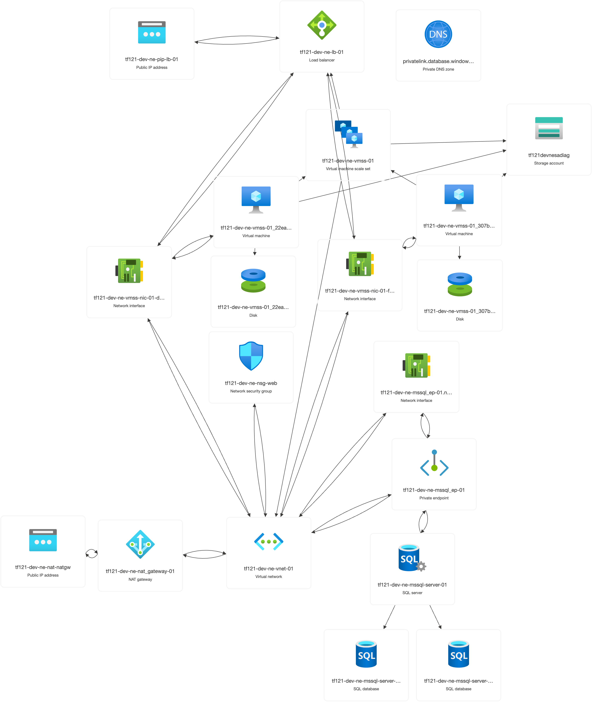

# Azure Terraform Sample

- [net-core.tf](net-core.tf) - VNet and Subnets
  - 2 subnets: one for web servers and one for database servers
  - address spacees are specified in `cfg.env-${LOCATION_CODE}-${ENV_NAME}.yml`
- [nsg.tf](nsg.tf) - Network Security Group
  - allow HTTP and HTTPS traffic to the web servers subnet
- [mssql.tf](mssql.tf) - Managed SQL Database
  - performance level specified in [cfg.global.yml](cfg.global.yml) `mssql.database_sku`
- [vmss.tf](vmss.tf) - Virtual Machine Scale Set
  - [azurerm_orchestrated_virtual_machine_scale_set](https://registry.terraform.io/providers/hashicorp/azurerm/latest/docs/resources/orchestrated_virtual_machine_scale_set) - current recommended VMSS from Azure
- [lb.tf](lb.tf) - Load Balancer
  - backend address pool with the web servers
  - health probe & load balancing rule for HTTP traffic

## Naming Convention

`${prefix}-${env_name}-${location_code}-${resource_type}-${instance_index}`

- see: [resource_naming module](modules/resource_naming/README.md)
- this approach
  - minimizes the configuration at the cost of additional lines of HCL
  - facilitates naming convention changes by change module & recreate
- to accomodate inconsistent naming deprecate the resource_naming module and add the resource names to the yml configuration files

## Procedure

### Select Workspace

- location code and environment names are parsed from workspace name by terraform `vars.tf`

```bash
export TF_WORKSPACE=ne-dev
export TF_VAR_mssql_server_admin_password='xxx'
ssh-keygen -m PEM -t ed25519 -f ~/.ssh/az-tf.id_ed25519.pem
```

### Initialize

```bash
terraform init -upgrade -migrate-state -force-copy
```

### Apply

```bash
terraform apply -auto-approve
```

### Test - vm - ssh

```bash
LB_FQDN=$(az network public-ip show --ids $LB_PIP_ID --query dnsSettings.fqdn -o tsv) && echo LB_FQDN=$LB_FQDN
LB_PIP_ID=$(terraform output -raw lb_pip_id ) && echo LB_PIP_ID=$LB_PIP_ID
VM_USERNAME=$(yq .vmss.username cfg.global.yml) && echo VM_USERNAME=$VM_USERNAME
open http://$LB_FQDN # confirm nginx page
ssh -i ~/.ssh/az-tf.id_ed25519.pem -o "StrictHostKeyChecking no" $VM_USERNAME@$LB_FQDN -p 50000
exit
```

### Test - sqlcmd - test

- https://learn.microsoft.com/en-us/azure/synapse-analytics/sql-data-warehouse/sql-data-warehouse-get-started-connect-sqlcmd
- install sqlcmd

```bash
ssh -i ~/.ssh/az-tf.id_ed25519.pem -o "StrictHostKeyChecking no" -p 50000 $VM_USERNAME@$LB_FQDN 'curl https://packages.microsoft.com/keys/microsoft.asc | sudo tee /etc/apt/trusted.gpg.d/microsoft.asc && sudo add-apt-repository "$(wget -qO- https://packages.microsoft.com/config/ubuntu/20.04/prod.list)" --yes && sudo apt-get update && sudo apt-get install sqlcmd'
```

- future development: add to [web.conf](web.conf) cloudinit

- test SQL via sqlcmd

```bash
AZURERM_MSSQL_DATABASE_NAME=$(terraform output -raw azurerm_mssql_database_id | awk -F/ '{print $NF}')
AZURERM_MSSQL_SERVER_NAME=$(terraform output -raw azurerm_mssql_server_id | awk -F/ '{print $NF}')
MSSQL_ADMIN_USERNAME=$(yq .mssql.admin_username cfg.global.yml)
echo sqlcmd -S $AZURERM_MSSQL_SERVER_NAME.database.windows.net -d $AZURERM_MSSQL_DATABASE_NAME -U $MSSQL_ADMIN_USERNAME -P \'$TF_VAR_mssql_server_admin_password\' -I -Q \""SELECT name FROM sys.tables;"\" | tee private-sql.sh
scp -i ~/.ssh/az-tf.id_ed25519.pem -o "StrictHostKeyChecking no" -P 50000 private-sql.sh $VM_USERNAME@$LB_FQDN:
ssh -i ~/.ssh/az-tf.id_ed25519.pem -o "StrictHostKeyChecking no" -p 50000 $VM_USERNAME@$LB_FQDN sh private-sql.sh
```

- future development: add to [web.conf](web.conf) cloudinit

## References

- https://github.com/Azure/terraform-azurerm-caf-enterprise-scale/blob/main/modules/connectivity/locals.geo_codes.tf.json region code lookup
- https://github.com/Azure/terraform/tree/master/quickstart/201-private-link-sql-database
- https://github.com/hashicorp-education/learn-terraform-azure-scale-sets

## Azure Resource Visualizer


